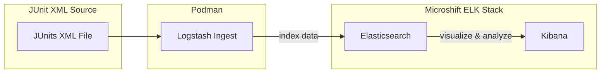

## Diagram




## Logstash junit feeder

- iniated by Running `./run.sh` 
- Parse Prow CI result JUnit XML files located in the `data` folder.
    for example:
    ```
    data/
    ├── job_1929719896736796672
    │   ├── junit_cos9-src@fips.xml
    │   ├── junit_cos9-src@flannel.xml
    │   ├── junit_cos9-src@greenboot.xml
    │   ├── junit_cos9-src@isolated-net.xml
    │   ├── junit_cos9-src@multi-nic.xml
    │   ├── junit_cos9-src@optional.xml
    ```
- Launch Logstash in a container, applying custom logic to parse the JUnit files.
- Detect and filter only the relevant test failures from the results.
- Send only those filtered failures to the Elasticsearch service running in MicroShift.

> **Note:** The Elasticsearch IP address is automatically extracted from the kubeconfig.


